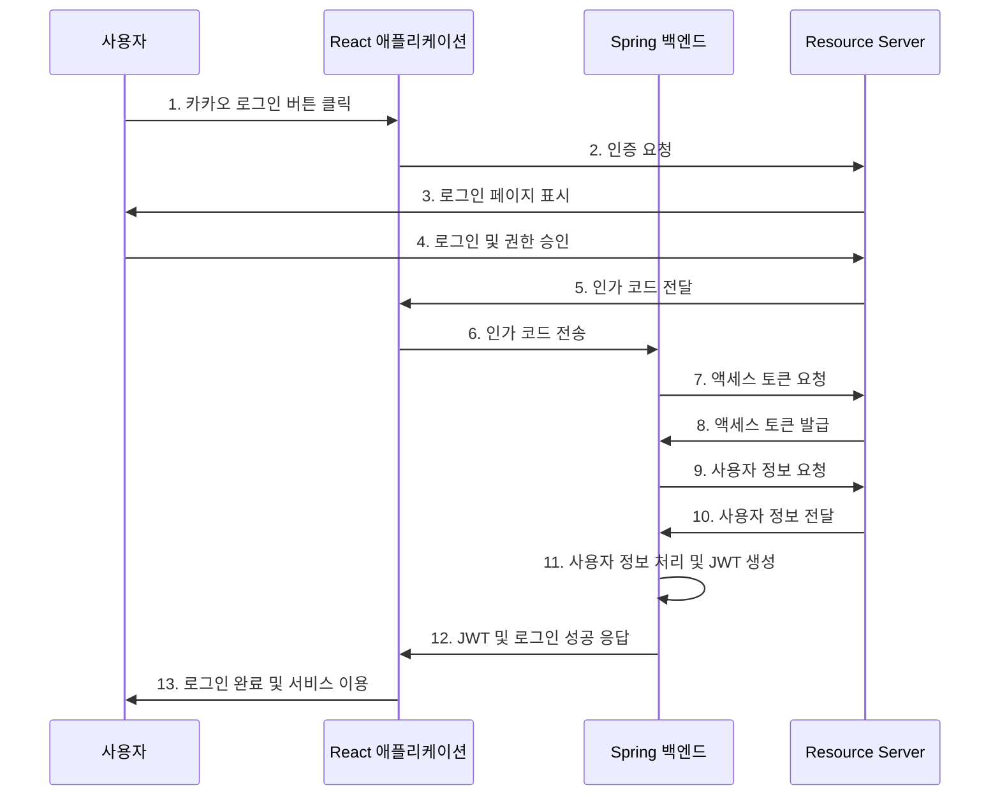

# 아흔 한 번째 포스팅

안녕하세요! 아흔 번째 포스팅으로 찾아뵙게 되어 반갑습니다!♥

오늘의 포스팅 내용은 **[React] 리액트에서 카카오 소셜 로그인? 너도 할 수 있어!**에 관한 내용입니다. <br/>
자세한 내용을 알아보러 갑시다❗️

**[Boongranii] Here We Go 🔥**

---

# 1️⃣ OAuth가 도대체 뭔데?


위 사진은 `캐치테이블`의 로그인 화면이다. 최근 대부분의 어플 및 사이트에서 소셜 로그인이 정말 많이 활성화되어 있는 것을 확인할 수 있을 것이다.

기존의 이메일, 아이디, 비밀번호로 회원가입을 통한 로그인은 정말 귀찮고 오래 걸려 사람들이 순식간에 로그인이 가능한 소셜 로그인을 도입하고 있는 것 같다.

물론 나도 사용하면서 매우 큰 편리함을 느끼기도 했고, 이 편리함은 도대체 어떻게 구현해야 하지? 하고 늘 궁금했었다.

궁금한 것은 참지 못하기에 내가 직접 해보기로 했다. 희 희

여기까지 일단 빌드업을 해뒀고 그럼 이제 진짜 OAuth가 무엇인지 알아보자.

## 🔥 OAuth란?

> **OAuth(Open Authorization)**는 인터넷 사용자들이 비밀번호를 제공하지 않고 다른 웹사이트상의 자신들의 정보에 대해 웹사이트나 애플리케이션의 접근 권한을 부여할 수 있는 공통적인 수단으로서 사용되는 개방형 표준 프로토콜이다.

이게 도대체 무슨 소리인가?

쉽게 말해서, OAuth는 우리가 다른서비스의 기능을 빌려 쓸 수 있게 해주는 간편한 키같은 것이다.

아까 `캐치테이블` 이야기는 왜 꺼냈을까?

우리가 새로운 애플리케이션이나 웹사이트에 가입하려고 할 때, 위 사진처럼 보였던 `카카오 로그인`이 바로 OAuth를 활용한 것이기 때문이다.

## 🔥 OAuth의 장점?

1. **보안성**: 일반적인 로그인 정보(아이디와 비밀번호)를 새로운 앱에 직접 제공하지 않아도 된다.
2. **편리성**: 새 계정을 만들 필요 없이 이미 사용 중인 계정으로 빠르게 로그인이 가능하다.
3. **제어성**: 새 앱이 어떤 정보에 접근할 수 있는지 선택할 수 있다.

이러한 장점이 존재하기에 최근 많은 애플리케이션에서 사용하는 것 같다.

## 🔥 OAuth의 주요 참여자

OAuth 프로세스에는 세 가지의 주요 참여자가 있다. 각 참여자의 역할을 이해하면 OAuth의 작동 방식에 대해 더욱 명확히 이해할 수 있을 것이다.

1. **Resource Owner**: 보호된 자원에 대한 접근 권한을 가진 소유자이다. 예를 들면, **카카오 계정을 가진 사용자**를 말한다.
2. **Client**: Resource Owner를 대신해서 보호된 자원에 접근하려는 애플리케이션이다. 예를 들면, **카카오 계정으로 로그인 기능을 제공하는 애플리케이션**을 말한다.
3. **Resource Server**: Client가 제어하고자 하는 자원을 보유한 서버를 말한다. 예를 들면, **카카오, 구글**을 말한다.

## 🔥 OAuth 로그인 프로세스



위와 같이 `mermaid`를 통해 시퀀스 다이어그램으로 그려보았다.

위 다이어그램으로 충분히 이해가 가능할 것이라 생각하지만 그래도 친절하게 글로 한 번 더 설명하겠다.

1. 사용자가 React 애플리케이션에서 카카오 로그인 버튼을 클릭한다.
2. React 애플리케이션은 카카오 OAuth 서버(Resource Server)에 인증 요청을 보낸다.
3. 카카오 서버는 사용자에게 로그인 페이지를 표시한다.
4. 사용자가 카카오 계정으로 로그인하고 앱의 권한 요청을 승인한다.
5. 카카오 서버는 React 애플리케이션에 인가 코드를 전달한다.
6. React 애플리케이션은 받은 인가 코드를 Spring 서버로 전송한다.
7. Spring 서버는 이 인가 코드를 사용해 카카오 서버에 액세스 토큰을 요청한다.
8. 카카오 서버는 Spring 서버에 액세스 토큰을 발급한다.
9. Spring 서버는 이 액세스 토큰을 사용해 카카오 서버에 사용자 정보를 요청한다.
10. 카카오 서버는 요청받은 사용자 정보를 Spring 서버에 전달한다.
11. 서버는 받은 사용자 정보를 처리하고 JWT(JSON Web Token)를 생성한다. JWT는 사용자 인증 상태를 안전하게 유지하고 서버와 클라이언트 간의 통신을 보호하는 데 사용된다.
12. 서버는 React 애플리케이션에 생성된 JWT와 함께 로그인 성공 응답을 보낸다.
13. React는 받은 JWT를 저장하고, 사용자에게 로그인 완료를 알리며 서비스 이용을 시작한다. 이후 API 요청에는 이 JWT를 포함시켜 사용자 인증을 수행한다.

위를 통해서 OAuth의 로그인 프로세스를 한 눈에 파악할 수 있을 것이다.

---

# 2️⃣ Kakao 소셜 로그인 시작

[**카카오 개발자 공식문서**](https://developers.kakao.com/docs/latest/ko/kakaologin/common)에 카카오 로그인에 대한 전체적인 프로세스가 소개되어있다. 위를 참고하면 좋겠지만 내 글도 도움이 되면 좋겠다.

사실 프로세스 과정만 이해하면 따라하는 수준이라 금방 할 수 있을 것이다.

## 🌀 앱 등록


[로그인-내 애플리케이션-애플리케이션 추가하기]를 하면 위와 같은 화면이 등장한다.

테스트용이면 간단하게 입력하면 된다.

## 🌀 앱 키

앱 등록을 하고 나면 [내 애플리케이션-앱 설정-앱 키]로 들어가면 아래와 같이 확인할 수 있다.


위 그림에서 앱은 현재는 삭제했으니 노출되어도 상관없는 키 값이다.

이번 포스팅에서 필요한 키는 `REST API 키`이다. 이 키를 `.env`파일에 안전하게 저장해두도록 한다.

```bash
VITE_KAKAO_REST_API_KEY=123456789
```

## 🌀 플랫폼 등록


[내 애플리케이션-앱 설정-플랫폼]으로 들어간다. 이번 포스팅에서는 Web으로 진행하기 때문에 Web 부분에 위와 같이 플랫폼을 등록해준다.

일단 개발 환경에서 테스트부터 해야하니 `http://localhost:5173`을 넣어 사용한다. 꼭 본인의 포트번호와 일치하는 것을 사용해야 한다. 또한, 백엔드가 아닌 프론트 측 URL을 입력해야 한다!!

## 🌀 Redirect URI 설정


[내 애플리케이션-제품 설정-카카오 로그인]으로 들어간다. 활성화 버튼을 모두 `ON`으로 바꿔주고 `Redirect URI`를 설정한다.

`localhost:5173`에서 카카오 로그인 버튼을 클릭하면서 요청을 하게 되는 것이니 인가 코드를 받을 경로를 넣어주면 된다.

위 사진처럼 하면 `oauth/kakao?code='인가코드'`가 포함된 uri로 리다이렉트 된다. 여기서는 개발 방향에 따라, 기호에 따라 작성하면 될 것이다.

---

# 3️⃣ 카카오 로그인 과정

웹 애플리케이션에서 카카오 로그인을 하는 과정은 크게 두 가지가 있다.

`REST API KEY`를 사용하는 방법과 `JavaScript KEY`를 사용하는 방법이다.

이 포스팅에서는 `REST API KEY` 방식에 초점을 맞추어 설명했다.

## 🐨 REST API 방식


이 다이어그램은 카카오 로그인 프로세스이다. 앞서 OAuth 설명에서 제시한 다이어그램과 유사한 흐름을 보인다.

```jsx
const KakaoLoginButton = () => {
  const K_REST_API_KEY = import.meta.env.VITE_KAKAO_REST_API;
  const K_REDIRECT_URI = import.meta.env.VITE_KAKAO_OAUTH_REDIRECT_URI;
  const kakaoURL = `https://kauth.kakao.com/oauth/authorize?client_id=${K_REST_API_KEY}&redirect_uri=${K_REDIRECT_URI}&response_type=code`;

  const handleKakaoLogin = () => {
    window.location.href = kakaoURL;
  };

  return (
    <Button
      variant="secondary"
      className="flex w-full items-center justify-center gap-2 rounded-md bg-[#FEE500] text-sm font-medium text-gray-700 transition-colors duration-300 hover:border hover:border-yellow-300 hover:bg-[#FFEB3B]"
      onClick={handleKakaoLogin}
    >
      <RiKakaoTalkFill size={20} />
      카카오 계정으로 로그인
    </Button>
  );
};

export default KakaoLoginButton;
```

이 코드는 카카오 로그인 버튼 컴포넌트를 구현한 것이다.

버튼을 클릭하면 `handleKakaoLogin` 함수가 실행되어 사용자를 카카오 로그인 페이지로 리다이렉트한다. 여기서 `K_REST_API_KEY`와 `K_REDIRECT_URI`는 환경 변수로 관리되어 보안을 강화했다.


위 이미지는 사용자가 리다이렉트된 카카오 로그인 화면이다.


로그인 후 나타나는 화면으로, URL에 인가 코드와 `Redirect URI`가 포함되어 있는 것을 확인할 수 있다.

사용자가 '동의하고 계속하기' 버튼을 클릭하면, 인가 코드가 서버로 전송되고 이를 기반으로 토큰을 받는 로직이 실행된다.

```jsx
const router = createBrowserRouter([
  {
    // ... (코드 생략)
    { path: KAKAO_OAUTH, element: <KakaoOAuthHandler /> },
  },
]);
```

이 코드는 라우팅 설정의 일부분이다. `KAKAO_OAUTH`는 `Redirect URI`와 일치하며, 이 경로로 리다이렉트되면 `KakaoOAuthHandler` 컴포넌트가 렌더링된다.

```jsx
import { useCallback, useEffect, useRef } from "react";

import { useNavigate } from "react-router-dom";
import axios from "axios";

import { useAuthStore } from "@/stores/AuthStore";

type Provider = "google" | "kakao";

const useOAuthHandler = (provider: Provider) => {
  const navigate = useNavigate();
  const processedRef = useRef(false);
  const setAccessToken = useAuthStore((state) => state.setAccessToken);

  const sendAuthCodeToServer = useCallback(
    async (code: string) => {
      try {
        const response = await axios.post(
          `/api/auth/${provider}`,
          { code },
          {
            withCredentials: true,
          }
        );

        if (response.data.accessToken) {
          setAccessToken(response.data.accessToken, provider);
          navigate("/");
        }
      } catch (error) {
        console.error(`${provider} 로그인 실패:`, error);
        navigate("/login", { replace: true });
      }
    },
    [navigate, provider, setAccessToken]
  );

  useEffect(() => {
    if (processedRef.current) return;

    const searchParams = new URLSearchParams(window.location.search);
    const code = searchParams.get("code");

    if (code) {
      sendAuthCodeToServer(code);
    } else {
      navigate("/", { replace: true });
    }

    processedRef.current = true;
  }, [navigate, sendAuthCodeToServer]);

  return null;
};

export { useOAuthHandler };
```

이 `useOAuthHandler` 훅은 카카오뿐만 아니라 구글 로그인에도 사용할 수 있도록 일반화되어 있다.

```jsx
const searchParams = new URLSearchParams(window.location.search);
const code = searchParams.get("code");
```

1. 위 코드를 통해 인가 코드를 추출하고 추출한 코드를 서버로 전송한다.
2. 서버로부터 받은 액세스 토큰을 상태 관리 스토어에 저장한다.
3. 로그인 성공 시 홈페이지로, 실패 시 로그인 페이지로 리다이렉트한다.

이 방식은 보안을 강화하기 위해 액세스 토큰을 클라이언트 메모리에 저장하고, 서버와의 통신 시 `withCredentials: true` 옵션을 사용하여 쿠키를 포함시켰다.

---

# 4️⃣ 마무리

이번 포스팅에서는 OAuth가 무엇이며 OAuth를 활용한 카카오 로그인에 대해 알아보았다.

카카오 로그인 방식 중에서도 `REST API` 방식으로 해보았는데 프론트 단에서 인가 코드를 서버에 전송하고 토큰을 메모리에 저장하는 방식으로 구현해보았다.

이렇게 하면 소셜 로그인은 완료가 된다.

이렇게 소셜 로그인을 직접 구현해봄으로써, 웹 애플리케이션의 인증 프로세스에 대한 이해도를 높일 수 있었다. 처음에는 복잡해 보였던 과정이 단계별로 접근하니 충분히 구현 가능한 기능임을 알게 되어 뿌듯했다.

이 글이 OAuth와 소셜 로그인 구현에 관심 있는 개발자들에게 도움이 되었기를 바란다. 읽어주셔서 감사하며, 혹시라도 오류가 있거나 개선할 점이 있다면 댓글로 알려주시면 감사하겠습니다. 함께 공부하고 성장하는 개발자 커뮤니티를 만들어 갑시다! 🙋‍♂️💻
